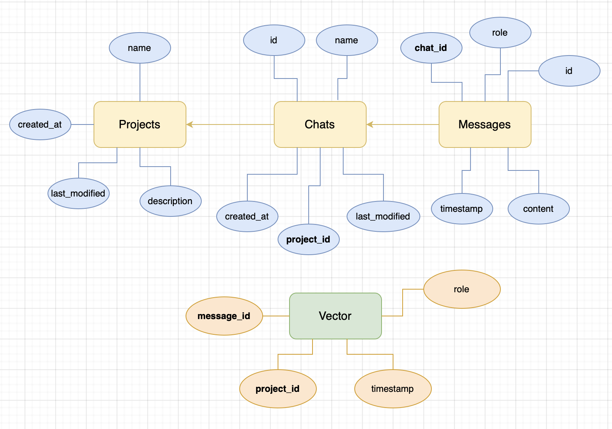
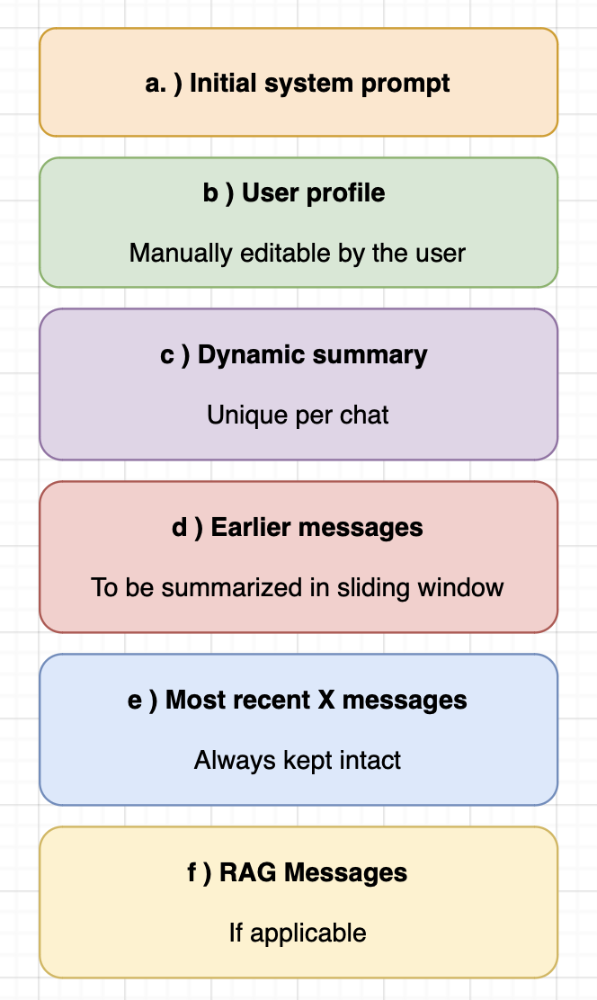

# Buddy
Learning project build upon the GPT api

## TODO (for me)
* RAG and vector db
* User profile, since this is distilled asynchronously, we can try using a local model
* Projects table (collection of chats, allow scoped RAG on chats inside a project in config.py)
* ~~Write UNIX C piping for the bridge, rn it’s just windows code~~ ✅
* Automatic prompting for api keys broken ever since I added frontend
* Add webview as submodule in git
* Frontend resizable windows
  * This is somehow harder than it looks.
  * Stumped llm count: (2) ~~o4-mini-high~~ ~~Sonnet 4~~
* write_file tool should open up a text editor for the user
* Link up renaming and deleting chats
* Give buddy a personality
* Text to speech and voice recognition
* Shell command pass-through; Intercept user shell commands such as cd and ls and exec them in the shell. Return the result back into the chat.
  * { type: “user-message”, payload: “what’s the weather today?” } <- passed through to python backend
  * { type: “user-message”, payload: “cd /home” } <- captured by C bridge 
  * Implement PTY within the C bridge. This gives us a persistent long-lived shell for each OS. This is fundamentally how electron apps like VSCode implement the terminal. 
  * PTY for UNIX <pty.h>, ConPTY for Windows


## Getting Started

### 1. Clone the repo

```bash
git clone https://github.com/njyeung/Buddy
cd Buddy
```

### 2. Frontend

#### a. (For development) Start server:

```bash
# From project root
cd frontend
npm install
npm run dev
```

**Make sure the localhost port matches the one in `main.c`:**

```c
// line 139
webview_navigate(w, "http://localhost:5173");
```

#### b. Or point towards built contents

If you’ve run `npm run build`, update `main.c` to point to the built bundle instead (i.e. a local file path), and rebuild the bridge executable (see step 4).

---

### 3. Install backend Python libraries

```bash
# From project root
cd backend
pip install -r requirements.txt
```

> You don’t need to run the backend manually. The C program will spawn it as a child process.
> So if you change the Python code, just restart the executable. It’s fast because webview is lightweight.

---

### 4. Run the executable to launch the app

* **For Windows:**
  `Buddy.exe`

* **For macOS:**
  `./Buddy`

* **For Linux:**
  `./Buddy`

---

### 5. (Optional) If you intend to modify the C bridge: Install webview submodule

Buddy uses webview to bridge the backend (Python) and frontend (React) via native pipes and threads. It’s not registered as a submodule, so you will need to:

#### a. Clone the webview repository manually

```bash
# From the Buddy root
git clone https://github.com/webview/webview
```

#### b. Make sure you install all of webview’s dependencies for your platform

See: [https://github.com/webview/webview](https://github.com/webview/webview)

#### c. Make changes to the bridge code located in the root directory

```bash
# Root directory
./main.c
```

> I made a Makefile to clean, configure, build, and copy the binary into the project root as `Buddy.exe`.

```bash
Run “make”
```

---

### (Optional) Preload API keys

Buddy’s backend will automatically prompt you for API keys when needed—so you don’t have to configure everything up front. For example, if you use the Spotify tool and don’t have credentials yet, Buddy will ask and save them for future use.

However, if you'd like to set things up manually ahead of time:

* Create a `.env` file in `/backend/`

* Add your OpenAI API key:

  ```env
  OPENAI=your-openai-api-key
  ```

* As well as keys for any tools you plan to use (see **Tools** below for an example on how to create your own tools):

  ```env
  SERPAPI_API_KEY=your-serpapi-key
  SPOTIFY_CLIENT_ID=your-spotify-client-id
  MY_EXAMPLE_TOOL_KEY=your-tool-key
  # ...etc
  ```

---


## Concepts of Projects, Chats, Messages, RAGs, Sliding Window, and User Profile

### 1. Persistent Chat History

All messages are stored in an SQL database, structured around a `projects` table, `chats` table, and `messages` table, where each message is associated with a `chat_id` and each chat is associated with a `project_id`. This enables support of multiple, independent conversations, each with its own navigable history ready to be displayed on the frontend.

In addition, projects help users organize related chats in a single folder.


*Figure a*

---

### 2. Retrieval-Augmented Generation (RAG)

For enhanced contextual awareness across chats, Buddy implements RAG. However, instead of using RAG to retrieve messages from the current chat (which is already summarized using the sliding window approach—see section 4), we pull semantically similar messages from other chats within the same project (or globally, depending on config).

This enables the language model to incorporate meaningful information from other interactions and deliver more intelligent, context-aware responses, while also letting the user control what it should “remember.”

#### How it works:

a. Important messages are vectorized and stored in a vector DB along with metadata tags (see figure a).
b. When a user inputs a new message, it is vectorized and used to query the vector DB for semantically relevant messages where `chat_id != current_chat_id` and `project_id == current_project_id`.
c. Each matching vector includes a metadata tag with the original `message_id`, which is used to retrieve the original message from the SQL database.
d. These retrieved messages are injected into the prompt as ephemeral memory.

> These retrieved messages are not persisted and do not affect the conversation history—they’re injected just-in-time to influence the model for a better response.

---

### 3. User Profile

Along with the initial system prompt, we also maintain a global user profile. This editable JSON includes traits such as:

* User’s name
* Country
* Preferred frameworks/languages
* Current projects and descriptions
* And more

Buddy uses liberal filtering to identify potentially “important” messages and queues them. When the queue grows large enough, we asynchronously distill the messages into profile updates.

This hybrid system balances transparency and automation: users can manually edit their profile or set an entirely new one at any time, while the assistant progressively builds a richer understanding of the user over time without manual intervention.

---

### 4. Sliding Window Summarization

To manage context length and token usage efficiently, Buddy employs a sliding window mechanism that periodically summarizes earlier parts of a conversation. The overall context structure follows this format:


*Figure a*

> 📌 *Diagram shown in README image above.*

Recent X messages (e) — configurable via `NUM_RECENT_MESSAGES_TO_KEEP` in [`config.py`](./backend/config.py) (default: 7) — are always preserved to maintain the most up-to-date context.

Whenever the combined character count from the start of the **dynamic summary system prompt** to the start of the **recent messages** exceeds N characters (set via `SUMMARY_TRIGGER_CHAR_COUNT` in [`config.py`](./backend/config.py), default: 5000), that section (c–d) is summarized by the slave model. The resulting summary replaces the original messages from that section.

As noted earlier, **RAG messages** (f) are ephemeral — they are injected just-in-time for the current API call and are not persisted in the chat history.

---

**The sliding window sits one level higher in granularity** than the recent messages and RAG snippets — it distills broader conversational context. However, it remains **below the user profile system prompt**, which contains long-term, cross-chat knowledge.

These summarized threads — system prompt, user profile, dynamic summary, and recent messages — are stored in the SQL database and automatically reloaded when the user returns to a chat. This lets the assistant resume where it left off and maintain continuity.

---

## Tools

Taking advantage of GPT’s tool use capability, tools in Buddy are modular functions designed to extend the assistant’s capabilities. All tool definitions are located in the `/backend/tools` directory and are automatically loaded into the API at runtime.

Tools extend the assistant’s capabilities beyond conversation. For example, Buddy can:

* Analyze a puzzle on your screen
* Decide to generate Python code to solve it
* Generate test cases
* Execute that code
* And return the result — all without being prompted at each step

> 💡 The above works exceptionally well for leetcode-style problems, but that’s cheating. I find much more useful occasions such as quickly scanning a long menu for a food I like, or playing a song thats similar to the one that’s on my screen

This autonomy is encouraged: Buddy is explicitly prompted to chain tool calls and act independently when pursuing a goal. However, long chains can increase hallucination or runtime risks (e.g. bot blockers during `web_fetch_page()`). To manage this, you can set the `MAX_FUNCTION_CALL_DEPTH` in [`config.py`](./backend/config.py) to limit how far Buddy can go before returning control.

---

### Basic Built-in Tools

I’ve experimented with a few basic tools, such as read_file() and write_file(), as well as some more playful features such as:

* [`spotify.py`](./backend/tools/spotify.py): various Spotify API tools
* [`search.py`](./backend/tools/search.py): `web_search()` and `web_fetch_page()`

---

### Creating Your Own Tool

To define a new tool, create a new file in `/backend/tools` or add to an existing one. Then write your function and decorate it with `@tool`, like so:

```python
@tool("description of what this tool does")
def func(param1: type1, param2: type2, ...):
    return [ return_value ]
```
* The function name becomes the tool’s identifier within the API.
* The description explains the tool’s purpose to the LLM.
* All parameters should be type-annotated for proper OpenAI schema generation (default is string).
* The return value is passed to GPT in the `content` field of a tool message:
```json
{
  "role": "tool",
  "tool_call_id": call.id,
  "content": return_value
}
```
If you return a custom object, make sure it's formatted clearly for the LLM to process.

---

### Live Reloading

Buddy watches `/backend/tools` via `watchdog.py`. The main process (`main.py`) reloads tools dynamically on any change—no restart needed. New or modified tools are available in the next API call.

---

### Disabling Tools

To disable a tool, simply comment out the `@tool()` decorator in its definition.

---

### Adding Requirements

If your tool depends on a library, just add it to `requirements.txt`.

---

## Learning outcomes

At one point I decided that the greatest UI to ever exist (the cli) was not enough, and I needed to ruin this project with some frontend-facing react slop. Instead of using Electron or spinning up a flask server for the python process to connect the backend and react frontend, I wanted to experiment with something more lightweight and unconventional. I chose to use Webview, a minimal C library that embeds web UIs in native apps without a full browser stack.

To enable communication between the Python and React layers, I wrote a small C layer that uses platform-specific code for Windows and Unix systems (piping and threads). This bridge handles:

* Standard output redirection from the Python process into the React app.

* Standard input piping from the React app back into the Python process.

* Message filtering, such as detecting MESSAGE.LOG-type outputs and printing them for debugging.

I know, this could’ve all been avoided if I used web sockets. Even though it wasn’t the “easy way out”, I wanted to apply what I learned from my classes about low-level IPC in a personal project that I did. Surprisingly, this decision eventually became one of my favorite unique parts of Buddy. It was an addition of a fun, non-traditional, off-the-beaten-path challenge to this learning project.

Inspired by the behavior of tiling window managers, the frontend employs a recursive Window component that builds a tiled layout in a similar fashion. We start with the chat window, reminiscent of a standard cli interface, but as the LLM opens or closes windows, the UI dynamically splits and adapts, creating a visually engaging, and albeit very annoying, user-LLM interaction. Even then, this ended up being one of the most visually interesting and satisfying parts of the UI.

As a frontend-leaning developer, hearing about the concept of recursive components for the first time (not just in React but in Angular and beyond!) genuinely excited me. I was itching to use it, even if this project didn’t necessarily need it. Actually, this project definitely didn’t need it. It’s more of “eye candy” than a practical feature, and nowhere near as useful as a true tiling window manager.

